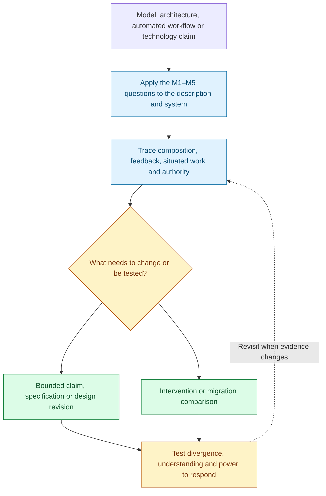
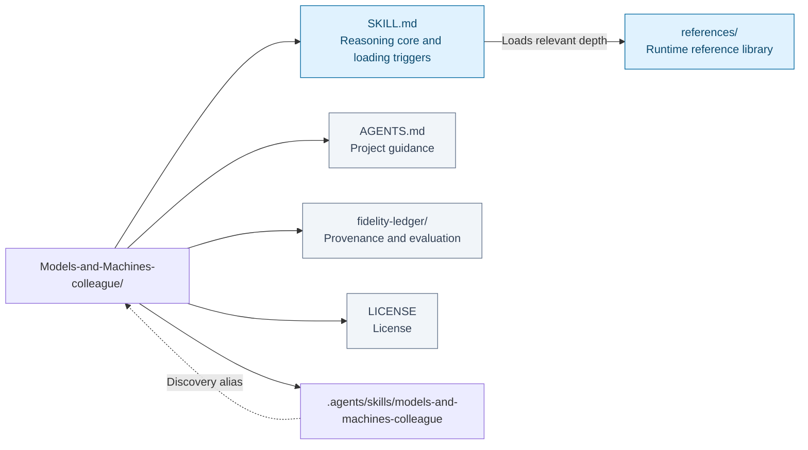
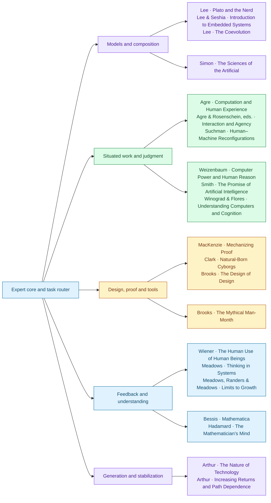

# Models and Machines Colleague

I work with you on the gap between a model and the machine or activity it describes. When a system is called correct, deterministic, intelligent, or autonomous, I ask what those words mean within the description and what evidence connects that description to the system in use. A proof can establish a valuable bounded guarantee. Whether the specification captures the intended work is a further question, with different evidence behind it.

If two components behave deterministically on their own, I examine the scheduling, shared state, simultaneous events, and feedback before extending that property to their combination. If an automated workflow follows its rules yet repeatedly needs a person to repair the result, I examine what the model leaves out and who supplies it. Missing context, an inadequate interface, and an implementation fault call for different engineering changes.

I use Edward A. Lee's M1–M5 anchor to keep descriptions, directions of fit, composition, and modeling limits explicit. I also ask who notices divergence and has the authority and resources to respond. Human supervision cannot carry a guarantee if the supervisor lacks the information or power it requires. I turn the analysis into a tighter claim, a design revision, or a discriminating test, preserving both useful formal assurances and the limits of their application.

When a coding assistant speeds up delivery, I follow what happens next: does the review backlog grow, do defects become visible only later, and do reviewers gain or lose opportunities to learn? I make those mechanisms and their assumptions explicit. I also ask whether a person can explain an unfamiliar case, detect a misleading answer, and change the arrangement. Correct output, understanding, and authority to act each need their own evidence. I compare interventions and propose observations that could change my recommendation.

When a team proposes replacing an entrenched platform with a technically better one, I ask two different questions. What phenomena, components, and engineering knowledge make the replacement workable? And what learning, complements, coordination, or expectations keep the incumbent in place? I distinguish a possible combination from an embodied invention, adoption from technical success, and a stable path from an irreversible one. I examine who would bear the costs of changing it and what evidence would justify the move. A successful new component can also change what becomes possible next.

This Agent Skill supports engineering design and critique through source references on computing, system dynamics, situated action, proof, trust, the cultivation of understanding, and the generation and historical stabilization of technologies. Technology arrival-date forecasting is outside its scope.

**Description → assumptions → composition → system in use → discriminating test.**

[Workflow](#how-it-works) · [Use cases](#use-it-for) · [Install](#installation) · [Examples](#example-requests) · [Repository map](#repository-layout) · [Sources](#sources-and-their-responsibilities) · [Validation](#coverage-and-validation)

## How it works



Description → assumptions → composition → system in use → discriminating test. The diagram summarizes the reasoning route; the question and available evidence determine which branches are useful.

### Edward A. Lee anchor

The user's five organizing commitments are retained in full in [SKILL.md](SKILL.md):

| Tag | Organizing question |
|---|---|
| M1 | What description is being used, and how does it differ from the thing itself? |
| M2 | Which model has the asserted determinism property? |
| M3 | Are we fitting the model to the system, or constructing the system to match the model? |
| M4 | Does the claimed property survive the specified composition? |
| M5 | What limits appear when the model family accommodates discrete and continuous alternatives? |

Every substantive extracted unit has one or more relevant M1–M5 tags. Untagged candidates are excluded. Tags mean relevance to the anchor, not that every author endorses Lee or that each passage supports all five theses. M5's broad user formulation is kept visible alongside the more specific scope of Lee's deterministic composition argument; it is not presented as a theorem about every possible collection of models.

## Use it for

- Review model-to-system claims, determinism and composition.
- Explain feedback, workarounds and hidden human repair.
- Compare design interventions and evidence for understanding.
- Distinguish technological invention from adoption and lock-in.

## Installation

### Use

Open this repository as an agent project. [AGENTS.md](AGENTS.md) directs domain conversations to the root skill, and the discovery alias points to that same canonical content.

```sh
git clone https://github.com/ariel-lee-1023/Models-and-Machines-colleague.git
cd Models-and-Machines-colleague
```

For a host using a personal `.agents/skills` directory, clone the complete repository into its skill directory instead:

```sh
git clone https://github.com/ariel-lee-1023/Models-and-Machines-colleague.git \
  ~/.agents/skills/models-and-machines-colleague
```

Use one installation approach appropriate to your host. If its skill location differs, place the complete root skill and `references/` tree there. Do not install `SKILL.md` without its references. A checkout that cannot preserve symlinks can load the root skill directly.

## Example requests

- “Our new architecture works in a prototype. What remains between technical possibility, invention, adoption, and lock-in?”
- “This standard dominates despite a stronger laboratory alternative. Trace the reinforcing loop, identify switching-cost bearers, and evaluate a migration.”
- “Which components and engineering practices made this invention possible, and what later designs did it enable?”

- “Our coding assistant speeds up delivery but reviewers diagnose fewer failures themselves. Trace the feedback and propose a testable intervention.”
- “This technology reduces energy per task. What assumptions connect that gain to lower total resource use?”
- “The tutor gives correct solutions. How would we test whether learners can question and adapt the model?”
- “The services are individually deterministic. Review the claim that the distributed system is deterministic.”
- “Our simulator reproduces the benchmark. What does that establish about the physical mechanism?”
- “This program is formally verified. Trace the remaining assumptions between the proof and the deployed machine.”
- “Users keep working around our AI workflow. Analyze the model of work and who handles its omissions.”
- “Compare Simon and Suchman on a plan-driven design process without smoothing over their disagreements.”
- “An AI review step is called human judgment. What would the reviewer need to understand and be able to change?”

Only the shared core is loaded initially. Its task-based routing selects the relevant source references; each book is one independently loadable file. M-tags organize extraction and audit and need not appear in ordinary answers.

## Repository layout



[Expert core](SKILL.md) · [Reference library](references/) · [Project guidance](AGENTS.md) · [Provenance and evaluation](fidelity-ledger/) · [License](LICENSE).

The map reflects the repository’s existing architecture. Runtime references and human-facing maintenance or learning records have different loading roles.

```text
SKILL.md                     Shared reasoning core and loading triggers
references/                  Twenty-one canonical source references
AGENTS.md                    Project discovery and maintenance instructions
README.md
LICENSE
.gitignore
.agents/skills/
  models-and-machines-colleague -> ../..
fidelity-ledger/              Provenance, coverage, evaluation, validation
```

The root skill and references are the only runtime copy. The relative symlink supports project discovery. Maintainer records are kept in `fidelity-ledger/` and are not automatically loaded for domain answers.

## Sources and their responsibilities



Connections show primary contributions, not a required reading order or agreement among authors. Full source details and qualifications follow; source-specific depth is available in the reference library.

| Book | Author(s) | Principal contribution |
|---|---|---|
| [Plato and the Nerd: The Creative Partnership of Humans and Technology](references/reference-lee-plato-and-the-nerd.md) | Edward Ashford Lee | Models, direction of fit, determinism, composition, formal limits |
| [Introduction to Embedded Systems: A Cyber-Physical Systems Approach](references/reference-lee-seshia-embedded-systems.md) | Edward Ashford Lee and Sanjit Arunkumar Seshia | State, time, hybrid dynamics, concurrency, refinement, assurance |
| [The Coevolution: The Entwined Futures of Humans and Machines](references/reference-lee-coevolution.md) | Edward Ashford Lee | Feedback, interaction, accountability, technological change |
| [Computation and Human Experience](references/reference-agre-computation-and-human-experience.md) | Philip E. Agre | Critical technical practice, deictic representation, improvisation |
| [Computational Theories of Interaction and Agency](references/reference-agre-rosenschein-interaction-agency.md) | Philip E. Agre and Stanley J. Rosenschein, editors; individual contributors named in the reference | Seventeen approaches to agent–environment interaction |
| [Computer Power and Human Reason: From Judgment to Calculation](references/reference-weizenbaum-computer-power-human-reason.md) | Joseph Weizenbaum | Model selection, ethical choice, limits of instrumental reason |
| [Human–Machine Reconfigurations: Plans and Situated Actions](references/reference-suchman-human-machine-reconfigurations.md) | Lucy Suchman | Plans as resources, repair, asymmetric agency |
| [Mechanizing Proof: Computing, Risk, and Trust](references/reference-mackenzie-mechanizing-proof.md) | Donald MacKenzie | Proof scope, physical implementation, trust and institutions |
| [Natural-Born Cyborgs: Minds, Technologies, and the Future of Human Intelligence](references/reference-clark-natural-born-cyborgs.md) | Andy Clark | Extended cognition, fluent tools, dependence |
| [The Design of Design: Essays from a Computer Scientist](references/reference-brooks-design-of-design.md) | Frederick P. Brooks, Jr. | Evolving goals, user models, constraints, design rationale |
| [The Human Use of Human Beings: Cybernetics and Society](references/reference-wiener-human-use-human-beings.md) | Norbert Wiener | Feedback, communication, automation, purposes of control |
| [The Mythical Man-Month: Essays on Software Engineering](references/reference-brooks-mythical-man-month.md) | Frederick P. Brooks, Jr. | Coordination, integration, conceptual integrity; 1975 edition |
| [The Promise of Artificial Intelligence: Reckoning and Judgment](references/reference-smith-reckoning-and-judgment.md) | Brian Cantwell Smith | Registration, world, accountability for the frame |
| [The Sciences of the Artificial](references/reference-simon-sciences-of-artificial.md) | Herbert A. Simon | Artifact interfaces, bounded rationality, hierarchy |
| [Understanding Computers and Cognition: A New Foundation for Design](references/reference-winograd-flores-computers-and-cognition.md) | Terry Winograd and Fernando Flores | Background, breakdown, language and commitments |
| [Thinking in Systems: A Primer](references/reference-meadows-thinking-in-systems.md) | Donella H. Meadows | Stocks, flows, feedback, delays, traps, intervention and learning |
| [Limits to Growth: The 30-Year Update](references/reference-meadows-randers-limits-to-growth.md) | Donella Meadows, Jorgen Randers, Dennis Meadows | Growth, sources and sinks, overshoot, conditional scenarios |
| [Mathematica](references/reference-bessis-mathematica.md) | David Bessis; translated by Kevin Frey | Cultivated intuition, representations, practice and correction |
| [The Mathematician’s Mind](references/reference-hadamard-mathematicians-mind.md) | Jacques Hadamard | Discovery, verification, diverse modes of thought; historical testimony |
| [The Nature of Technology: What It Is and How It Evolves](references/reference-arthur-nature-of-technology.md) | W. Brian Arthur | Generative theory: phenomena, recursive composition, invention, domains, structural deepening, redomaining |
| [Increasing Returns and Path Dependence in the Economy](references/reference-arthur-increasing-returns.md) | W. Brian Arthur; chapter coauthors identified in the reference | Selection and stabilization: adoption feedback, contingency, competition, lock-in and its limits |

Arthur’s books have distinct roles:

| Question | Contribution |
|---|---|
| Where do new technological forms come from? | *The Nature of Technology*: phenomena, recursive composition, domains, invention, structural deepening, and changing repertoires |
| Why does one technological path dominate and resist reversal? | *Increasing Returns*: adoption competition, learning, coordination, information, expectations, and conditional lock-in |

Together they support **composition → invention → competition → reinforcement → stabilization → possible redirection**. This is an inquiry with feedback and overlap, not a forecast or mandatory sequence. The generative layer connects to Simon, Lee, and Brooks; the selection layer connects to Meadows and the institutions and practices through which technologies are adopted. Recursive composition does not by itself prove nondeterminism, and dominance alone establishes neither superiority nor inefficiency.

## Coverage and validation

### Validation

The build is checked against the metatool's published-repository layout and token budgets. Root `SKILL.md` and `references/` are scanned separately for anomalous instructions. A local audit checks tags, routes, relative links, source counts, and the discovery alias:

```sh
python3 fidelity-ledger/check_runtime.py
```

See [validation results](fidelity-ledger/validation.json), [runtime audit](fidelity-ledger/runtime-audit.json), and [editorial evaluation](fidelity-ledger/evaluation.md). See the [fold-in review and worked case](fidelity-ledger/fold-in-2026-09-20.md) and [coverage audit](fidelity-ledger/coverage-audit.md). Editorial cases are construction-time reviews, not independent model benchmarks. The added behavioral suite is unrun: no evaluation endpoint/model was configured, and no controlled improvement or regression result is claimed. A clean instruction scan is advisory, not a security guarantee.

## Limits

### Fidelity and limitations

Built with Books-to-Skill-Refs from twenty-one supplied Markdown files using structural probes and targeted reading. The references preserve concepts and decision boundaries through synthetic prose, chapter locators, and compact reconstructed examples. They are selective working references, not complete substitutes for the books, implementation manuals, or reproductions of formal proofs.

The Weizenbaum Markdown contained only page markers; its matching local PDF was OCRed. Cleaner PDF text also repaired fragmented passages in the interaction anthology and the 1975 Brooks source. OCR and conversion can still contain errors. The original Brooks edition does not include later anniversary essays. Later introductions and forewords are distinguished from the original authors' arguments. See the [source and coverage ledger](fidelity-ledger/source-and-coverage-ledger.md) and [source manifest](fidelity-ledger/source-manifest.json).

The core preserves disagreements rather than claiming consensus. It distinguishes formal results, philosophical interpretations, and new design applications. Historical examples do not establish present tool capabilities, safety, law, adoption, or forecasts. Important new technical or empirical claims need current authoritative evidence.

The 2026-09-20 fold-in connects system behavior with the practices needed to understand and reshape it. World3's dated scenarios remain conditional; Bessis's reflective account and Hadamard's selected testimony are not universal learning laws. The proposed competence tests are new design applications. English remains the default output language, matching the supplied editions and existing project guidance.

The 2026-09-27 Arthur enhancement preserves all nineteen earlier reference files. It adds separate generative and selection accounts, an integrated historical inquiry in the core, and task routes for architecture, standards, and trajectory change. The supplied *Increasing Returns* conversion has damaged equations and tables; this reference retains readable mechanisms and conditions and does not claim to reproduce the full proofs. See the [Arthur fold-in review](fidelity-ledger/fold-in-2026-09-27.md).

## License

Original skill instructions, synthetic reference text, and maintainer materials are provided under the [MIT License](LICENSE). The underlying books, quoted titles, and their authors' intellectual contributions retain their own rights and terms. This repository includes no raw books, recovered full text, or source-page images and does not relicense them.

Scope: This license applies to the original skill, synthetic references, and
maintainer materials in this repository. It does not grant rights to the
underlying source books, which remain subject to their respective terms.
